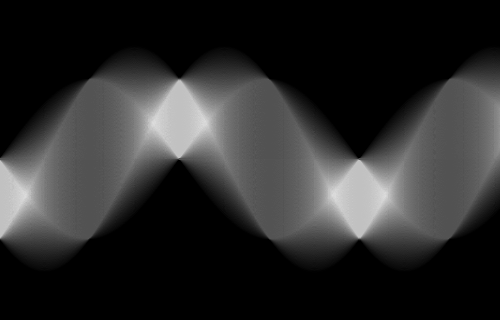

<!--  -->

[](http://unitary.fund)
[](https://HomodyneCT.github.io/MartaCT.jl/stable)
[](https://HomodyneCT.github.io/MartaCT.jl/dev)

# [**Marta CT**](https://gitlab.com/homodyne-ct/MartaCT.jl)
###### _A Julia package for CT images reconstruction and analysis_

## Installation

The MartaCT package can be installed with the following commands:

```julia
import Pkg
Pkg.add("https://gitlab.com/homodyne-ct/MartaCT.jl")
```

## Documentation

Please find the documentation [here](https://homodynect.github.io/MartaCT.jl/stable/).

## License

Please see [here](./LICENSE) for licensing information.

## Acknowledgements

The current development of the HCTTs package is possible thanks to a grant funded by [**UnitaryFund**](https://unitary.fund).

The development of the HCTTs package has been possible thanks to the funding of the [_Attract Consortium_](https://attract-eu.com) under the project [_Quantum Imaging for Tomography (QuIT)_](https://attract-eu.com/selected-projects/quantum-imaging-for-tomography-quit).

Further funding has been provided by [_AZIENDA ULSS 8 BERICA -
Vicenza - U.O._](https://www.aulss8.veneto.it) in order to continue the work, beyond its deadline, which has been afflicted by the [COVID-19](https://it.wikipedia.org/wiki/COVID-19) lockdown, preventing the collaboration with the Health Care partner.
